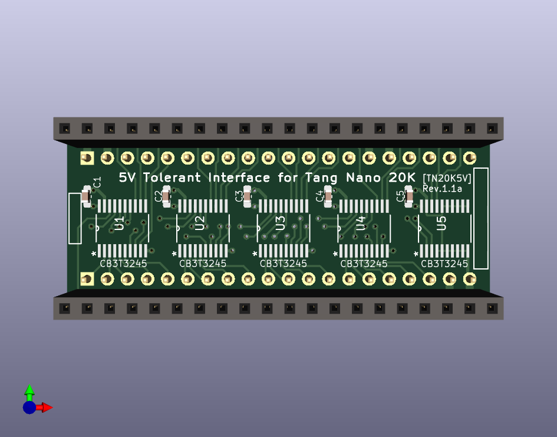
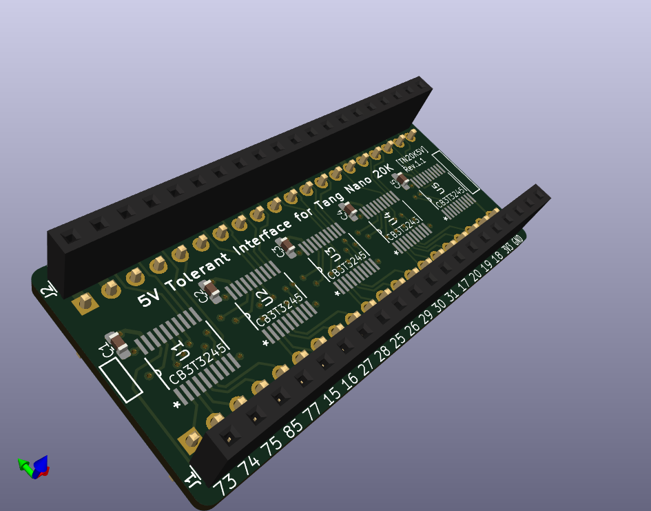
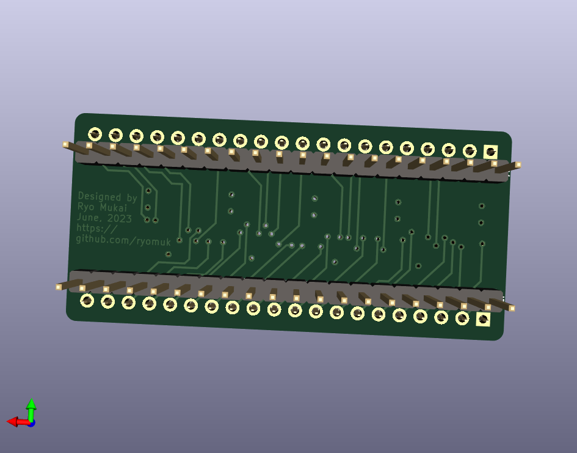
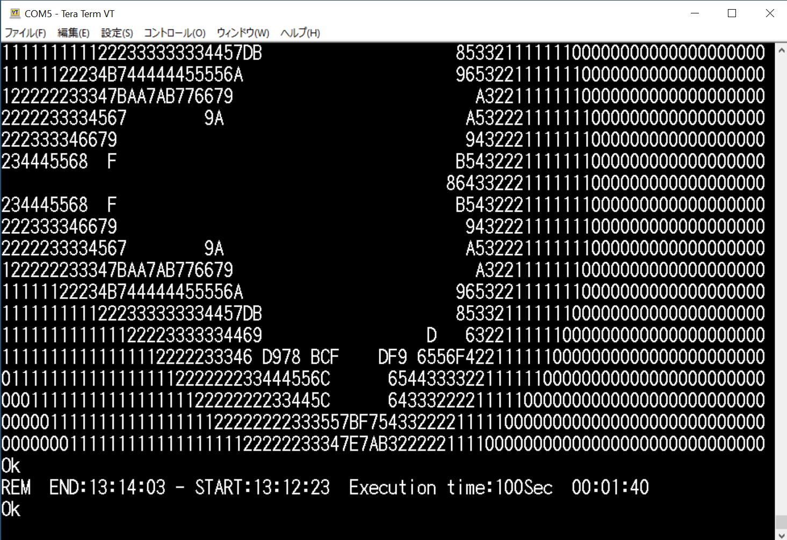
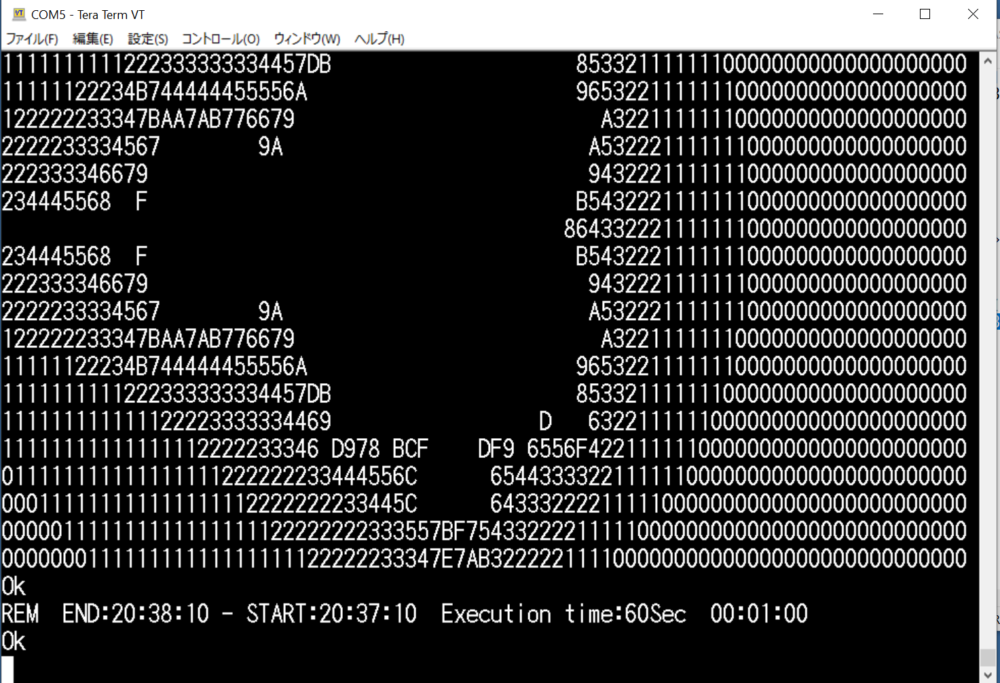
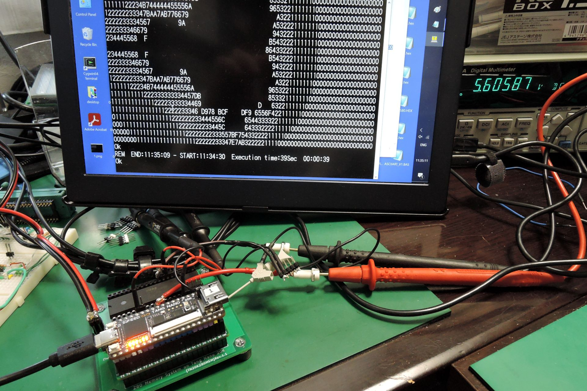

# tangnano-5V
5V tolerant interface for Tang Nano 20K (and 9K(TBA))

This document is written mostly in Japanese. If necessary, please use a translation service such as DeepL (I recommend this) or Google.

# 概要
Tang Nano 20Kを5V系の回路に接続するためのインターフェースです．
(9K用は現在作成中．)

# Tang Nano 20K 版(rev.1.1)
## 機能
- Tang Nanoの20KのGPIO(全34本)を，SN74CB3T3245(レベルシフタ搭載バススイッチ)を介して5V系(TTL, CMOS)に接続します．
- バッファではなくスイッチで行なっているため，特に信号方向を意識することなく双方向接続が可能，信号の伝達遅延は0.25ns以下です．

## 原理
- 5V→3.3VはSN74CB3T3245によって5V系から3.3V系にレベル変換されます．
- 3.3V→5Vはレベル変換は行なわれず，3.3V系の信号が出力されますが，5VTTLの閾値は1.5V，5VCMOSの閾値は2.5Vなので問題無いということのようです．

## 動作の確認状況
- 27MHzのシステムクロックが全GPIOで5V系に出力できることを確認しました．(75番ピンについては下記参照)
- 5V系→3.3V系: 5Vの入力信号に対し，出力が3.3Vになることを確認しました．
- 3.3V系→5V系: 3.3Vの入力信号に対し，出力が3.3Vになることを確認しました．
- データシートによると遅延はmax 0.25nsで，手元のオシロでは測定限界以下でした．

## Tang Nano 20Kの75番ピンについて
- Tang Nano 20K(v3921)の75番ピンは，C51(100nF)でGNDに接続されているため，そのままだと低速(数十KHz)でしか動作しません．他のピンと同様に使用するためにはC51を外す必要があります．低速動作で構わないのであれば気にしなくていいです．

## BOM
|Reference          |Qty| Value          |Size |Memo |
|-------------------|---|----------------|-----|-----|
|C1, C2, C3, C4, C5 |5	|0.1uF	         |1608(mm)(0603(inch))| |
|J1, J2	            |2	|pin socket      |1x20 |for Tang Nano 20K|
|J3, J4             |2	|pin header      |1x20 |for 5V GPIO|
|U1, U2, U3, U4, U5 |5	|SN74CB3T3245PW  |TSSOP| |

## 画像

# 応用例
## TangNanoZ80MEM (Applications/TangNanoZ80MEM)
- Z80用のメモリシステムとクロック回路です．
- クロックはTTLレベルではなくHでVcc-0.6Vのレベルが必要なので外付けのICで引き上げています．4MHz程度であれば330Ωプルアップ抵抗だけでも動きました．
- Z84C0020，ブレッドボードで20.25MHzで動作しました．
- Z80のVccをTangNano側のVCC(USB給電)と別にしたいこともあるかもしれないので，ピンヘッダで接続するようにしています．
- DBG_TRGとLED_RGBはデバッグ用の信号です．
- 75番ピンはRESET_nに割り当てたのでC51を外さなくても動作します．
- PCB版で27MHz(USB給電，Vcc=4.94V), 31.5MHz(Z80のVcc=5.6V)で動作しました．

ASCIIART.BAS実行結果 (12MHz)

ASCIIART.BAS実行結果 (20.25MHz)

ASCIIART.BAS実行結果 (31.5MHz, Vcc=5.6V)

## 参考文献，データシート等
- [SN74CB3T3245 Data sheet](https://www.ti.com/lit/ds/symlink/sn74cb3t3245.pdf)
- [Application Note CBT-C, CB3T, and CB3Q Signal-Switch Families](https://www.ti.com/lit/an/scda008c/scda008c.pdf)
- [Logic Guide, Texas Instruments](https://www.ti.com/lit/sg/sdyu001ab/sdyu001ab.pdf)
- [ロジック・ガイド(日本語版), Texas Instruments](https://www.tij.co.jp/jp/lit/sg/jajt217/jajt217.pdf)

## 更新履歴
- 2023/6/16: 初版公開 (Tang Nano 20K用 rev.1.1)
- 2023/6/25: 応用例(TangNanoZ80MEM を追加)
- 2023/6/26: TangNanoZ80MEMのピン配置を変更．(rev1.0→rev.1.1)
- 2023/6/28: TangNanoZ80MEMの uart.vを更新．
- 2023/7/06: TangNanoZ80MEMを修正．27MHz(Vcc=5.0V), 31.5MHz(Vcc=5.6V)で動作．
