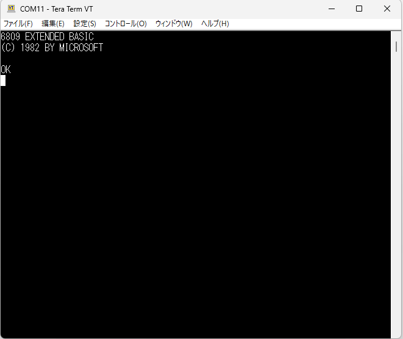
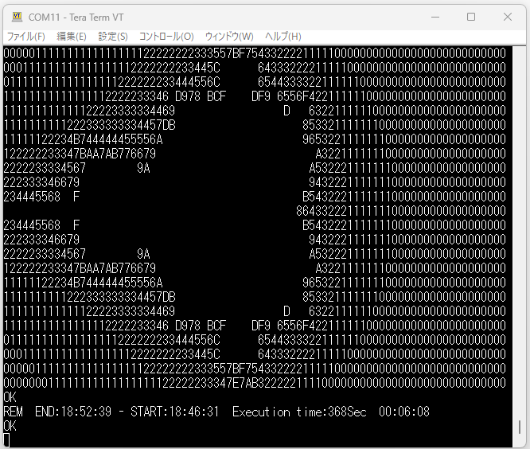

# TangNano6809MEM
- MC6809用のメモリシステムとクロック，UARTです．
- [電脳伝説さんのSBC6809](https://vintagechips.wordpress.com/2017/12/05/sbc6809%E3%83%AB%E3%83%BC%E3%82%BA%E3%82%AD%E3%83%83%E3%83%88/)のdatapackに入っているBASIC9がバイナリそのままで動きます．

BASIC9起動画面

ASCIIART.BAS実行結果 (外部クロック6MHz)

## 注意事項
- PC接続時にUSB経由の通信が確立しない問題があることがわかりました．
- ~~入力に使用しているピンのどれかがUSB-JTAGの初期化用の信号と競合しているのが原因な気がしますが特定できませんでした．~~
- ~~下記のようにVCCのラインを切断して，PCと接続後に6809のVCCを継げるという手順が必要です．~~  ~~images/6809_vcc.jpg~~
- RESET_n(pin75)のプルアップ抵抗(R1)が原因でした。pin75は内部で10KでプルダウンされていてB616_BOOTに継がっており、それと競合していました。
- R1を外すことにより上記問題は解決します。

## 更新履歴
- 2023/07/19: 応用例にTangNano6809MEMを追加
- 2024/04/11: TangNano6809MEMに関する注意事項記載
- 2024/04/15: README修正(6809、R1の除去について, TangNano20Kのピンに関するメモ)

