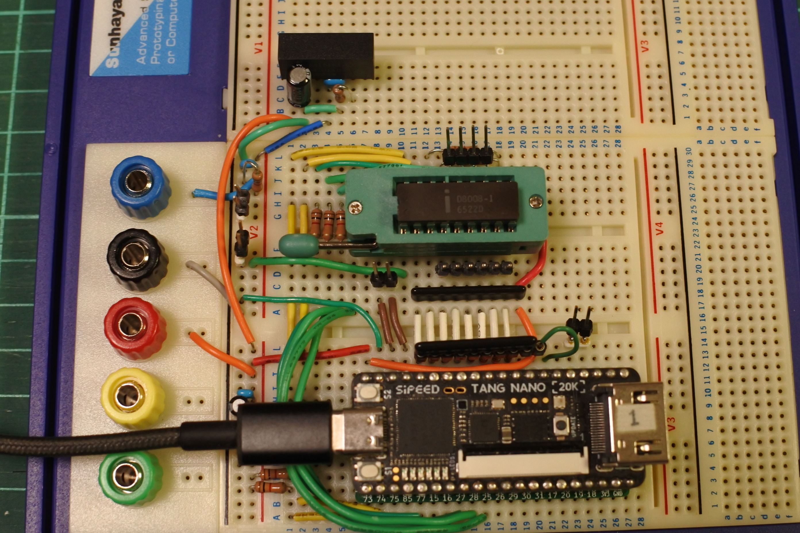
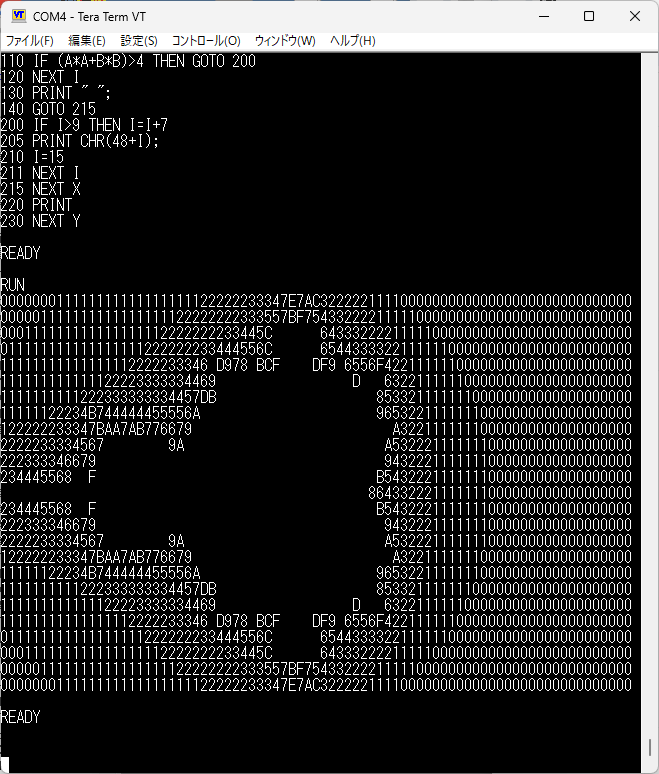

# TangNano8008MEM
## 概要
- Intel 8008用のメモリシステム，クロック，UARTです．

## ブレッドボード版のハードウェアについて

- 回路図は[hardware/rev.1.0](hardware/rev.1.0/)にあります．
- 配線量が少なく，クロックも低速なのでブレッドボードで簡単に作れました．
 - あまりに簡単に作れたので，基板を作るモチベーションが湧きません．
- -9VはDCDCコンバータで作りました．
- users manualには入出力はTTLレベルと書いてありますが，波形を観測したところ8008の出力はマイナス電位にもなるようでした．
  - バス(D0〜7)には外付けでクランプダイオードを回路に入れていますが，SN74CB3T3245にはクランプダイオードが内蔵されているので無くても動きます．
  - SYNC, S0〜2は1KΩの抵抗だけ入れてSN74CB3T3245内蔵のクランプダイオードに任せています．

## FPGAに実装したもの
- プロジェクトは[TangNano8008MEM_project](TangNano8008MEM_project)です．
- 16KBメモリ (8008のアドレス空間は14bitなのでフル実装です．)
- UART(TXバッファ付き)
- 割り込み機能
- 8008にはRESETが無いので，下記でRESET相当のことを実装しました．
  - SW1: バスにHALTを出力してSTOPさせ，INTERRUPT信号をアサートし，バスにRST0命令を挿入．(power-up時も同様)
  - SW2: INTERRUPT信号をアサートし，バスにRST0命令を挿入

## ソフトウェアについて
### echo back test ([software/echo](software/echo))
- UARTの入出力テスト用プログラムです．
- polling版と割り込み版はソースのdefine文で切り替えます．

### SCELBAL (SCELBI Basic) ([software/sc1](software/sc1))
- Twitterで[SCELBAL (SCELBI Basic)](https://www.willegal.net/scelbi/scelbal.html)なるものが存在することを教えてもらったので試してみることにしました．

#### SCELBI Basicのバイナリ作成方法等
- [ASL(The Macroassembler AS)](http://john.ccac.rwth-aachen.de:8000/as/), Perlをインストールして下さい．私はWindowsのCygwin環境で使っています．
- ASLで，radix 8とすれば良いようだったのですが，その場合に10進数をどう表記するかわからなかったので，radixは10のままで8進数にQを付けるスクリプトを書いて対処しました．その他の修正も全部スクリプトで実施するようにしました．
- どうやら文字コードの8bit目が1のようで，コンソールの入出力は入出力ルーチンで対処すれば簡単だったのですが，アセンブラのプログラムの方も
```
DB "FOR"
```
を
```
DB 'F'+80H
DB 'O'+80H
DB 'R'+80H
```
のように展開する必要があるようなので変換しました．
- I/Oルーチン(CINP, CPRINT)を書く必要があったので user.asm に書きました．
  - 文字コードの8bit目が1であることへの対応．
  - どうやらCINPではecho処理も行う必要があるようでした．
- バイナリ作成手順は下記の通り．
```
cd TangNano8008MEM/software/sc1
wget https://www.willegal.net/scelbi/software/sc1.asm
cp sc1.asm sc1.asm.org
./conv.pl < sc1.asm.org > sc1.asm
make
./bin2v sc1.bin > rom.v
```

#### 実行サンプル
- お約束のASCIIART.BASを実行してみました．FOR文からGOTOで抜けるとエラーになるので微修正しました．
- 計測マクロがうまく動かず，正確な時間は測定できなかったのですが，クロッ
ク500kHzで約6時間40分で完走しました．


## 関連情報
- [bitsavers /intel/MCS8](http://www.bitsavers.org/components/intel/MCS8/)
- [www.mars.dti.ne.jp/~mark08](http://www.mars.dti.ne.jp/~mark08/index.html) 8008に関する日本語の参考資料について網羅されています．
- [SCELBAL (SCELBI Basic)](https://www.willegal.net/scelbi/scelbal.html)
- [github.com/jim11662418/8008-SBC](https://github.com/jim11662418/8008-SBC)
- [The Macroassembler AS](http://john.ccac.rwth-aachen.de:8000/as/)
