# TangNano8080MEM

## 概要
- Intel 8080用のメモリシステム，クロック，UART，diskエミュレータです．
- Universal Monitor や CP/Mが動きます．

## PCB rev.1.1
- 回路図，ガーバーファイル等は[hardware/rev.1.1](hardware/rev.1.1/)にあります．
### BOM
|Reference          |Qty| Value          |Memo |
|-------------------|---|----------------|-----|
|C1                 |1  |2.2uF           |     |
|C2,C6              |2  |1uF             |     |
|C3,C4              |2  |10uF            |     |
|C5,C7,C8           |3  |0.1uF           |     |
|D1,D2              |2  | LED            |任意     |
|J1                 |1  | DIP-40 Socket or 20x1 Pin frame x2  |TangNano5V用|
|J2,J3              |2  |Conn_01x20      |任意(観測用)|
|PS1                |1  |MAU104          |5V→12V用DCDC,  https://akizukidenshi.com/catalog/g/g104132/ |
|PS2                |1  |TJ7660          |5V→-5V用, https://akizukidenshi.com/catalog/g/g112017/|
|R1                 |1  | 10k             |     |
|R2,R3              |2  | 1k〜100k(適宜)     | 値はLEDにあわせて任意|
|R4,R5              |2  | 47     | クロック用ダンピング抵抗|
|RN1                |1  | 4.7k x8       |データバスプルアップ     |
|RN2                |1  | 100k x4       |制御信号プルアップ       |
|U1                 |1  | MIC4427 |  クロックドライバ|
|U2                 |1  | 40pin ZIFソケット |  8080用|

- RN2は当初10KΩにしていたのですが，TangNano20Kのpin75はB616_BOOTに継がっていて，起動時にUSBを検出してくれなくなってしまうので100kΩに変更しました．[TangNano6809MEM](../TangNano6809MEM)で起きていたのと同様の問題でした．

## FPGAに実装したもの
- プロジェクトは[TangNano8080MEM_project](TangNano8080MEM_project)です．
- [TangNanoZ80MEM-CPM](../TangNanoZ80MEM-CPM/)をベースにして，2相クロック，8228相当の制御信号の変換を追加しました．

## クロックの設定
top.v で下記の1つを選択して下さい．
```
// select one of the following CLK frequency
//`define  CLK_3MHz     // 3.0MHz(333ns)
`define  CLK_2MHz   // 2.077MHz( 481ns)
//`define  CLK_1MHz   // 1.038MHz( 963ns)
//`define  CLK_500kHz // 519.2KHz(1930ns)
```

## ROMの選択
- top.v で下記の1つを選択して下さい．
```
// select one of the following 2 applications
`define USE_CPM
//`define USE_UNIMON

```
このオプションで，rom.vでincludeするファイル，UART用レジスタのビットフィールドを切り替えています．

## CP/Mの起動方法
- [TangNanoZ80-CPM](../TangNanoZ80MEM-CPM/)と同じ手順で作成したdiskイメージで起動できます．

## 動作確認状況
- 下記CPUで動作CP/Mが起動し，BASICでASCIIART.BASが完走しました．

#### Intel C8080A
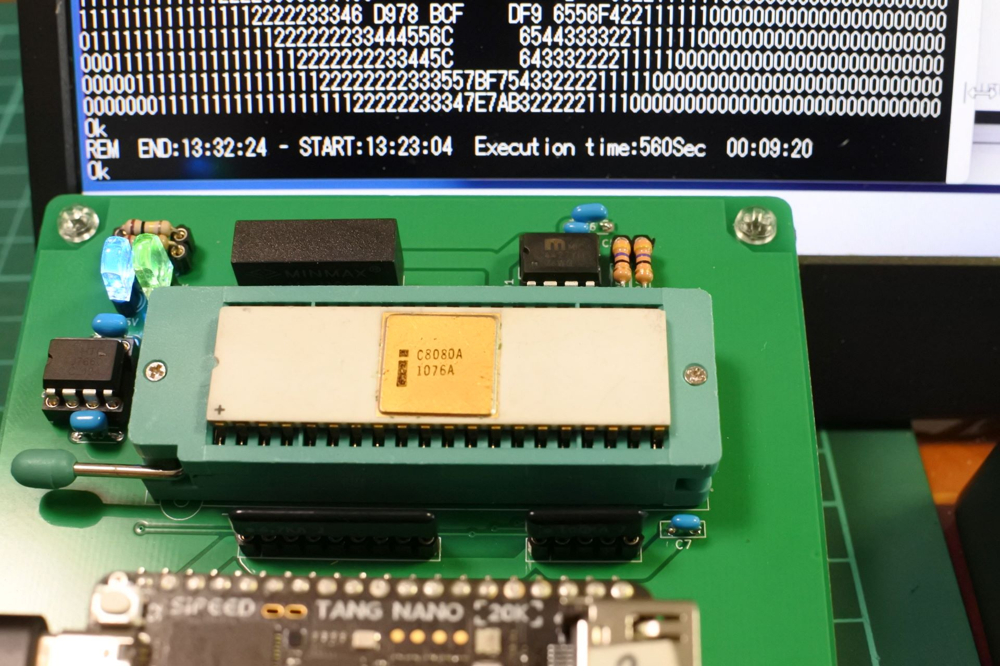
#### Intel P8080A-1 (3MHz)
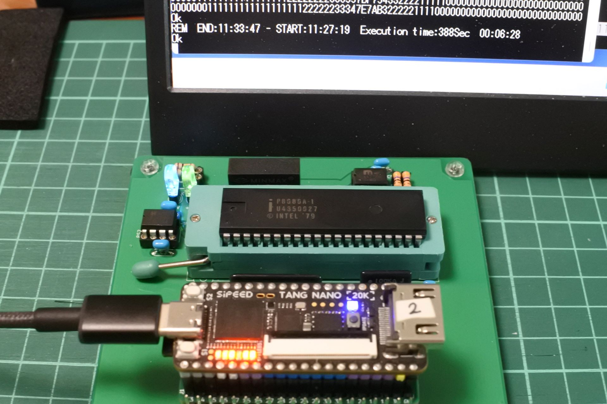
#### NEC uPD8080A
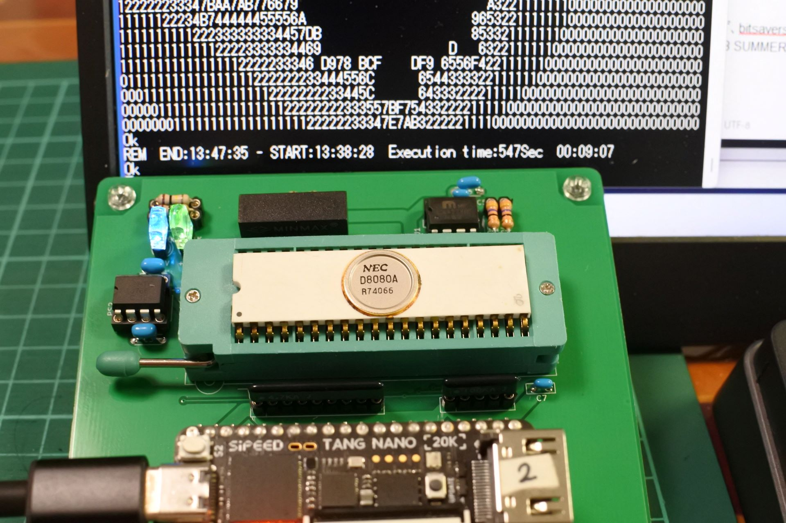
#### NEC uPD8080AF
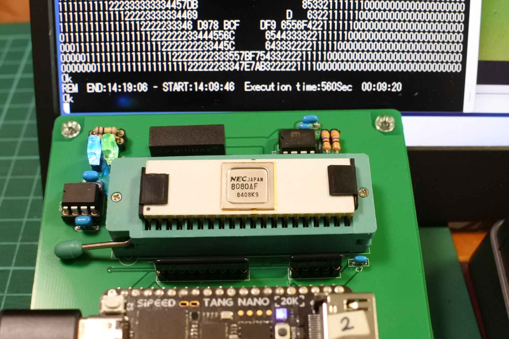
#### NEC uPD8080AFC-1 (3MHz)
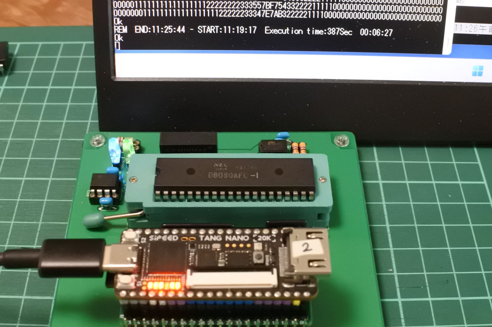
#### NEC uPD753(+変換基板)
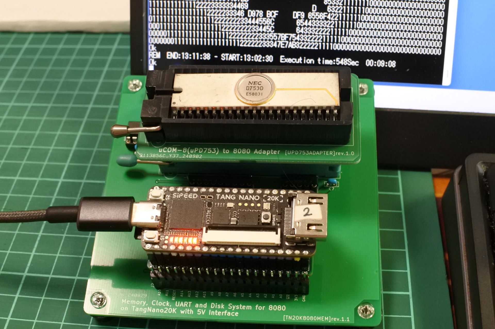
#### 三菱M58710S(8080A)
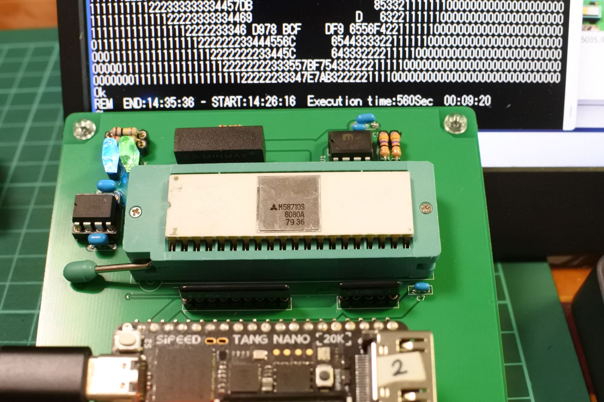
#### AMD AM9080ADC(C8080A)
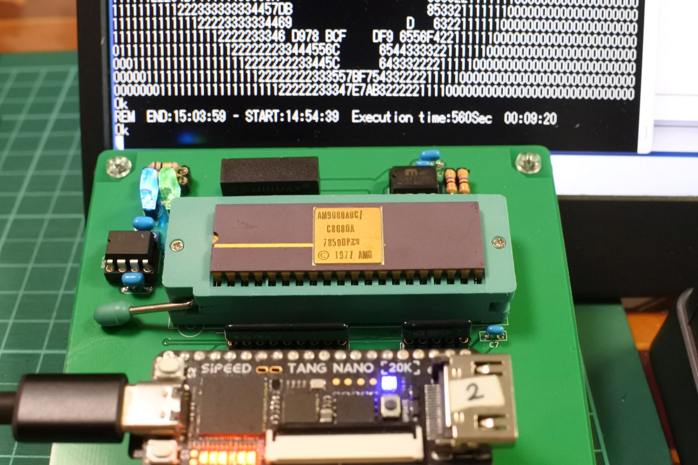
#### AMD AM9080ADCB
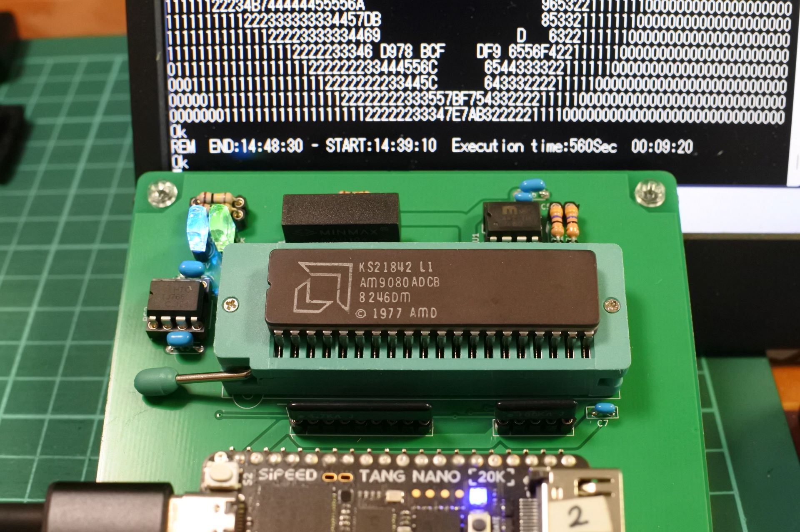
#### NS INS8080AN
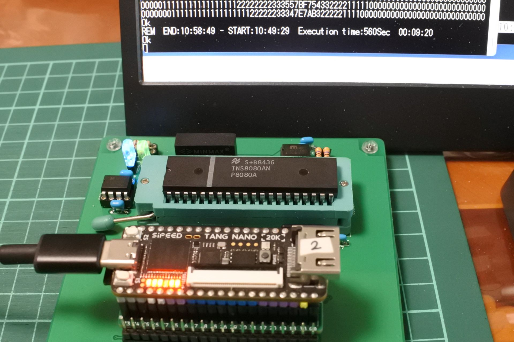
#### TI TMS8080ANL
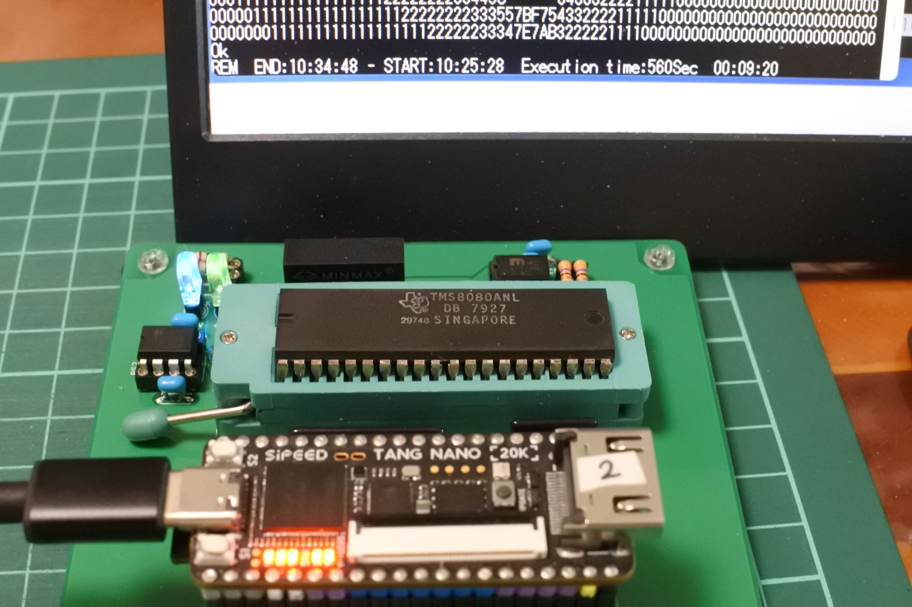

## 既知の問題
- ~~下記CPUで動作しないので原因調査中です．~~
  - ~~NS INS8080AN, TI TMS8080ANL~~
  - メモリ書き込みのタイミングを修正して解決しました．

## 参考にした先行事例，関連サイト等
- [satoshiokue/MEZ8080](https://github.com/satoshiokue/MEZ8080)
- [satoshiokue/EMUZ80-8080](https://github.com/satoshiokue/EMUZ80-8080)
- [Gazelle8087/EMUZ80-8080G](https://github.com/Gazelle8087/EMUZ80-8080G)
- [電脳伝説/SBC8080](https://vintagechips.wordpress.com/2018/06/24/sbc8080-cpu%E3%83%AB%E3%83%BC%E3%82%BA%E3%82%AD%E3%83%83%E3%83%88/)
- [Electrelic/Universal Monitor](https://electrelic.com/electrelic/node/1317)

## 更新履歴
- 2024/09/08: 初版公開
- 2024/09/13: メモリライトタイミング修正，3MHz対応

