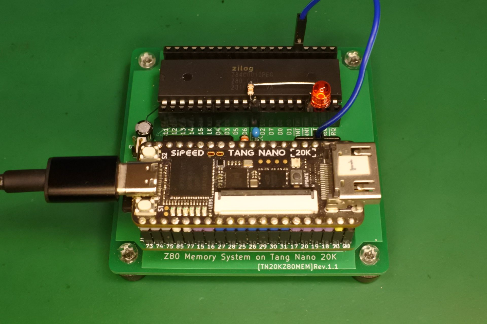
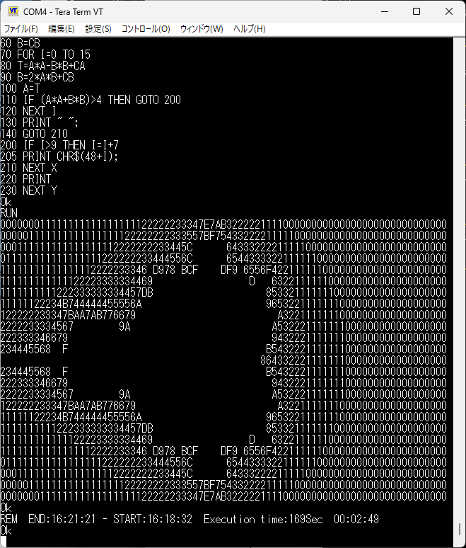

# TangNanoZ80MEM-CPM


- TangNanoZ80MEMにfloppy/hard diskエミュレータを追加してCP/Mを動作させる試みです．
- TangNano20Kのスロットに搭載したSDメモリカードを使用してfloppy/hard diskをエミュレートします．
- ハードウェア(基板)はTangNanoZ80MEMと同じものにBUSREQ_n用のジャンパ線を1本追加します．
- 実験用に作ったものですので，いろいろと不備やバグがあると思います．

## 実装した機能について
- とりあえずお試しで作ってみたので，最小限の機能しか実装していません．
- PRT, AUXは未実装です．
- TangNanoのピンが足りないので，BUSACK_nは見ていません．
- SW1はZ80のRESET_nによる通常のリセットです．
- SW2はIPLを強制的に0000H〜00FFHにロードしてリセットします．

## floppy/hard disk エミュレータについて
- SDメモリはファイルシステム無しの生のままで使うのでddで読み書きします．
- SanDiskのsd(2GB)，KIOXIAのsdhc(32GB)，SAMSUNGのsdxc(64GB)での動作を確認しています．
- drive a, b, c, dは256KBのフロッピー，drive i,jは4MBのHDDです．512MBのdrive pというものもあるようなのですが，track, sectorの指定方法がわからなかったので未実装です．
- diskのイメージは下記のような感じで配置して下さい
```
dd if=drivea.dsk of=sd.dsk bs=128 seek=0
dd if=driveb.dsk of=sd.dsk bs=128 seek=2048
dd if=drivec.dsk of=sd.dsk bs=128 seek=4096
dd if=drived.dsk of=sd.dsk bs=128 seek=6144
dd if=drivei.dsk of=sd.dsk bs=128 seek=8192
dd if=drivej.dsk of=sd.dsk bs=128 seek=40960
```

## CP/Mのイメージファイルについて
最初は
[udo-munk/z80pack](https://github.com/udo-munk/z80pack)のcpm22をそのまま使おうと思っていたのですが，コンソール入力がうまくいかなかったので，Universal Monitorで使っているコンソールのI/Oの仕様
```
data   = 00H; 
status = 01H;
 bit0: rx_data_ready
 bit2: tx_ready
```
にBIOSを書き変えたものを使いました．

## とりあえず動かすための手順
### ジャンパ配線
- DBG_TRG を BUSREQ_n に接続します．


### disk imageの準備
- z80packのcpm22のbiosにパッチをあててmakeしたものを使ってdrivea.dskを作り，drive.b.dskとつなげて sd.dskを作成します．
- 書き込み先のsdメモリが/dev/sdb で正しいかちゃんと確認すること．間違えるとPCのディスクを破壊します.
- 下記手順を参考にして下さい．ちなみに私はVMWare上のubuntuで作業しています．

```
- z80packを取ってきてbuildする
git clone https://github.com/udo-munk/z80pack.git

- ビルドにはjpgとglの開発環境が必要っぽいので下記で追加．
sudo apt install libjpeg-dev
sudo apt install freeglut3-dev

cd z80pack
make

- disksフォルダにcpm22用のdiskをコピーしておく
cd z80pack/cpmsim
rm -f disks/drive[ab].dsk
cp disks/library/cpm22-1.dsk disks/drivea.dsk
cp disks/library/cpm22-2.dsk disks/driveb.dsk
cp disks/library/hd-tools.dsk disks/drivei.dsk
cp disks/library/hd-toolsrc.dsk disks/drivej.dsk

- bios-tangnano.patch をあててmakeする
cd z80pack/cpmsim/srccpm2
patch -b < bios-tangnano.patch
make

- drivea.dsk を更新する
./putsys

- drivea.dskとdriveb.dskを継げてsd.dskを作る
dd if=../disks/drivea.dsk of=sd.dsk conv=notrunc bs=128 seek=0
dd if=../disks/driveb.dsk of=sd.dsk conv=notrunc bs=128 seek=2048
dd if=../disks/drivei.dsk of=sd.dsk conv=notrunc bs=128 seek=8192
dd if=../disks/drivej.dsk of=sd.dsk conv=notrunc bs=128 seek=40960

- sdメモリに書き込む(/dev/sdbで正しいかどうかは十分確認すること)
sudo if=sd.dsk of=/dev/sdb
```

## 実行サンプル
- [www.retroarchive.org/cpm](http://www.retroarchive.org/cpm/)にあったmbasic.com を，z80packのシミュレーターにファイルを転送してdisk imageを作って実機で実行してみました．

- MBASIC(BASIC-80 Rev.5.21)


- MBASICでASCIIART.BAS


- SUPER STARTREK


## 動画
- [TangNanoZ80MEM-CPM でStarTrek](https://www.youtube.com/watch?v=MoRSxTNyhwA)

## 関連情報，参考にしたサイト等
- z80pack [udo-munk/z80pack](https://github.com/udo-munk/z80pack)
- SuperMEZ80-CPM [hanyazou/SuperMEZ80-CPM](https://github.com/hanyazou/SuperMEZ80-CPM)
- CPUville [cpuville.com/Code/CPM.html](http://cpuville.com/Code/CPM.html)
- [www.retroarchive.org/cpm](http://www.retroarchive.org/cpm/)
- [www.z80.eu](http://www.z80.eu/)
- Universal Monitor [https://electrelic.com/electrelic/node/1317](https://electrelic.com/electrelic/node/1317)

## 更新履歴
- 2024/07/23: 初版公開
