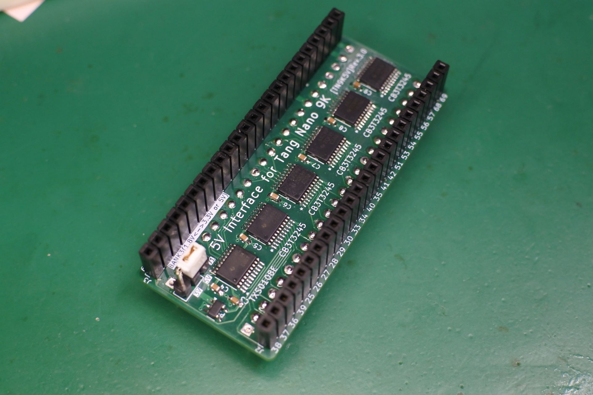
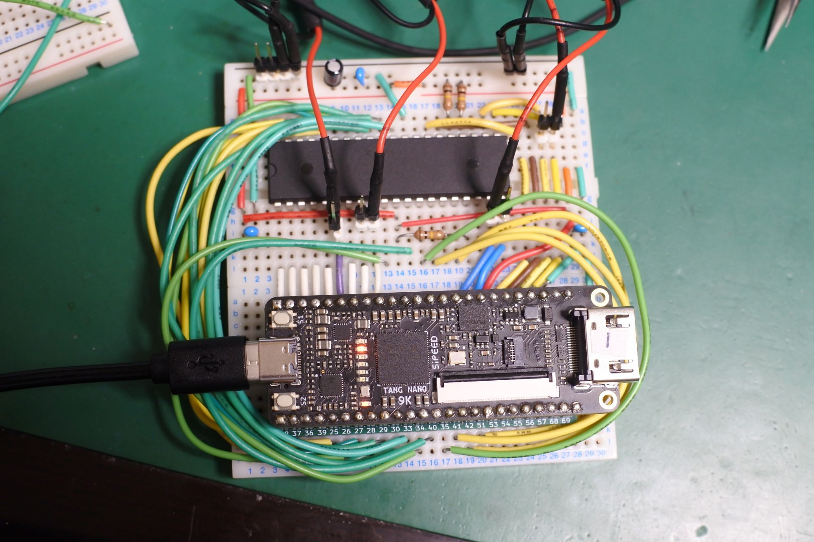

# Tang Nano 9K 版(rev.3.0)
## rev2.0からの差分
- rev2.0(全バンクでTXS0108Eを使用)では、Pin68～75(HDMI用ピン)への入力で異常発振したり、USB接続が出来無くなったりする問題が発生していましたが、3.3Vバンクを20K版と同じ74CB3T3245に変更したところそれらの問題が解消しました。
  
## 機能
- Tang Nanoの9KのGPIO(全45本)を5V系(TTL, CMOS)に接続します．
- 信号方向を意識することなく双方向接続が可能です．
- Pin79〜86は1.8Vのバンク(BANK3)なのでTXS0108Eを用いて，1.8V←→(5V or 3.3V)の変換をします．その他のピンはCB3T3245を用いて3.3V←5V, 3.3V→3.3Vです．

## 動作の確認状況
- 27MHzのシステムクロックが全GPIOで5V系に出力できることを確認しました．
- 入力は単体試験(1ピンづつ)では期待通りの動きをしますが，入出力混在時に怪しい挙動を示しました．

### 見つかった問題点
- (pin63 & pin86) をそれ以外の全ピンに出力するというテストで出力がおかしくなることがある．おそらくBANK3(1.8V系)がなんらかの干渉をしている．
- pin68〜75は入出力とも若干歪む．

### 問題点を回避するためのガイドライン
- BANK3(1.8V系)は出力専用にする．
- HDMI用のピンは歪むので動作を確認しながら使う．

## BOM
|Reference            |Qty| Value          |Size |Memo |
|---------------------|---|----------------|-----|-----|
|C3,C4,C5,C6,C7,C8,C9 |7  |0.1uF	   |1608(mm)(0603(inch))|C1,C2は無し |
|J1                   |1  |pin header      |1x3 |BANK3 HI側の電圧選択用|
|J2,J3                |2  |pin socket      |1x24 |for TangNano9K|
|J4,J5                |2  |pin header      |1x24 |for 5V GPIO|
|PS1                  |1  |TLV71318        |SOT23-5| 1.8Vレギュレータ|
|U1                   |1  |TXS0108EPW      |TSSOP| |
|U2,U3,U4,U5,U6       |5  |SN74CB3T3245PW  |TSSOP| |

- C1,C2は.1.8Vレギュレータ用でしたが不要なので消した後にアノテーションし直すのを忘れて欠番になっています．

## 画像

## 応用例
## TangNanoZ80MEM_9K [applications/9K/TangNanoZ80MEM_9K](../../applications/9K/TangNanoZ80MEM_9K)

- 9K用インターフェースの動作確認用にブレッドボードで組んでみました．
- ~~とりあえず4.5MHzならたいていのピン配置で動きました．今のところ13.5MHzが限界．20K版ほど高速には動作しませんでした．~~
- ~~HDMIのコンデンサを外したら余計に動作しなくなったり，ピンアサインを変えるだけで動作しなくなったりするのでどこかにタイミング的な問題がありそうです．~~
- ~~MREQ_nはHDMIピンに継げた方が安定するので，MREQ_nでアドレスをラッチしているあたりが怪しそう．~~
- メモリライトのタイミングをWR_nではなくCLKでトリガーするようにしたら27MHzでも動くようになりました。ただし、HDMI端子のコンデンサ除去必須です。

## 更新履歴
- 2023/7/11: Tang Nano 9K用 rev.2.0公開 (若干問題あり)
- 2024/4/21: Tang Nano 9K用 rev.3.0公開
